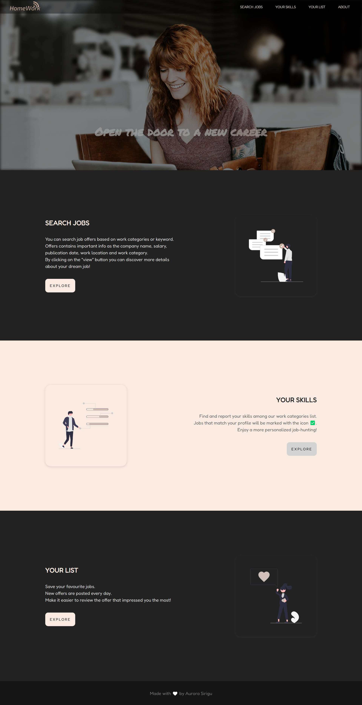
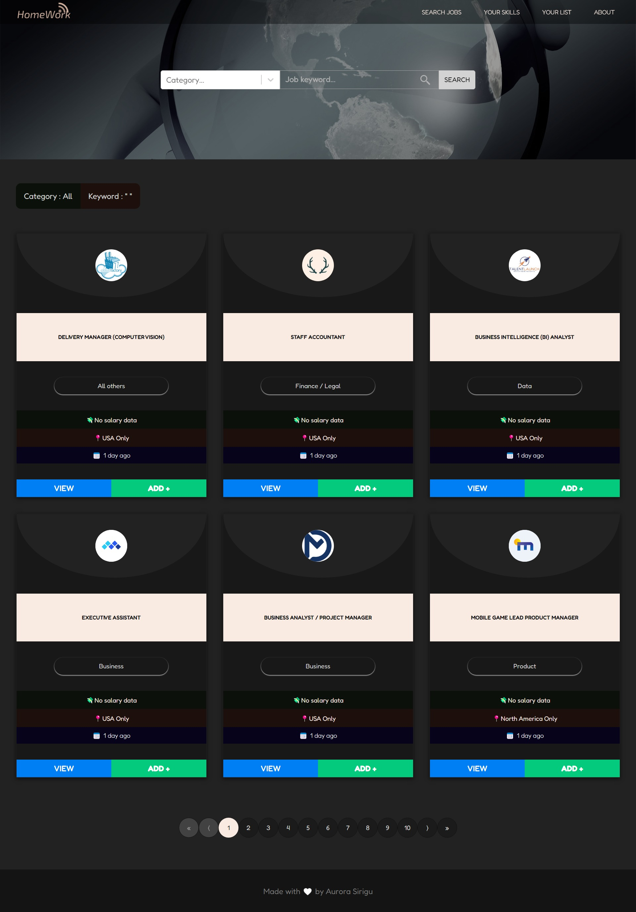
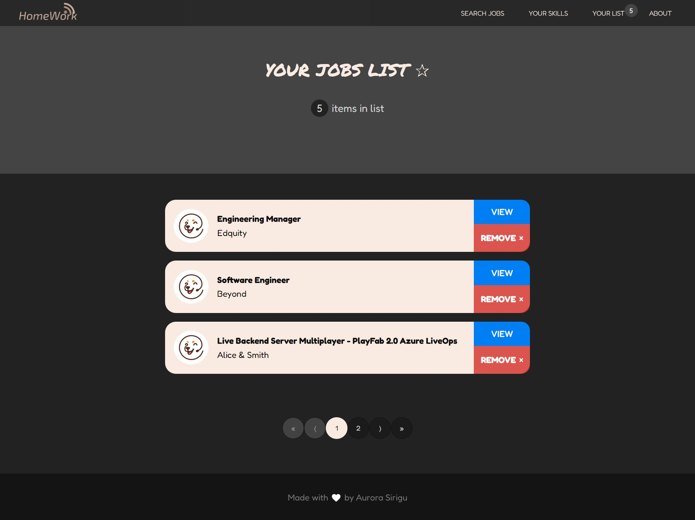
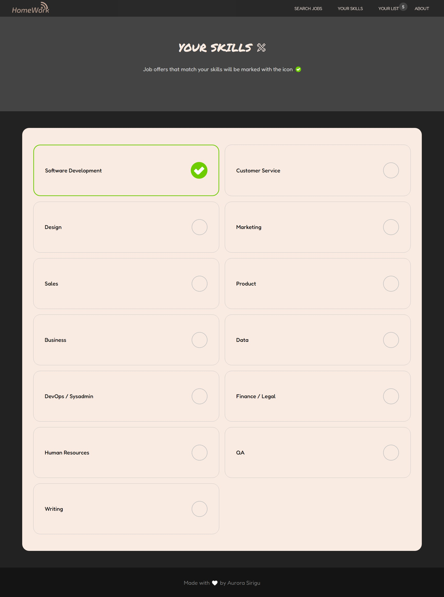
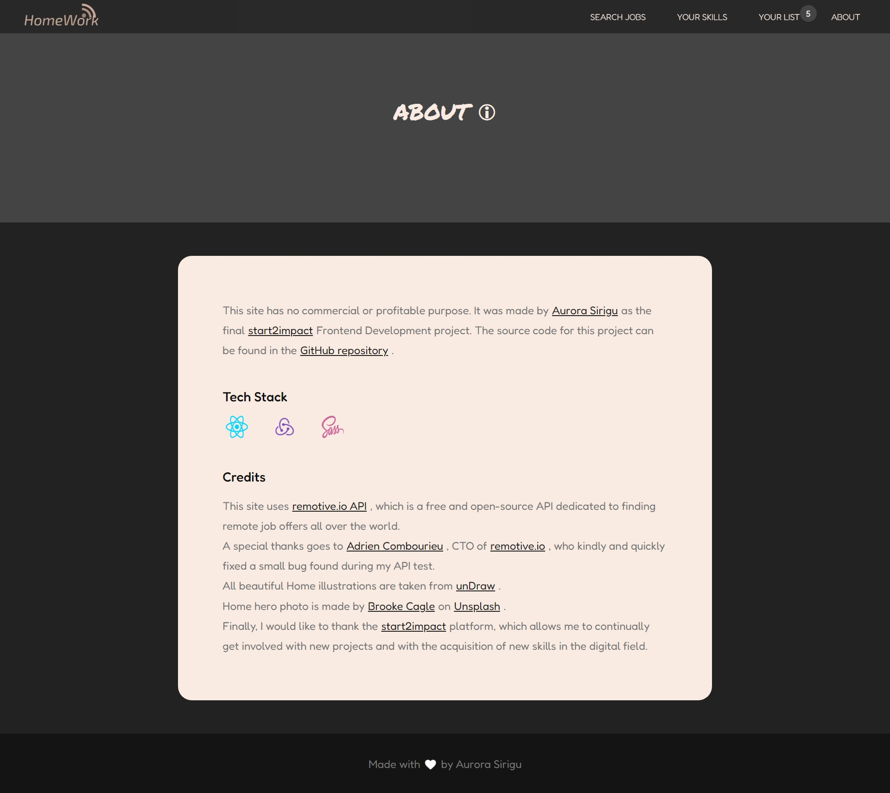

<p align="center">

  <p align="center">
    <a href="https://github.com/Auro-93/home-work-app">
        
    </a>
   </p>
  
  <h3 align="center">HomeWork App</h3>

  <p align="center">
    An app to search for remote jobs, save offers in your favorites and find jobs that match your skills, built with React, Redux-Toolkit and Sass.
  </p>

  <br>
  <br>

  <h3 align="center">Preview</h3>

  <a href="https://github.com/Auro-93/home-work-app">
    
  </a>

  <a href="https://github.com/Auro-93/home-work-app">
    
  </a>

  <a href="https://github.com/Auro-93/home-work-app">
    
  </a>

   <a href="https://github.com/Auro-93/home-work-app">
    
  </a>

   <a href="https://github.com/Auro-93/home-work-app">
    
  </a>

</p>

<details open="open">
  <summary><h2 style="display: inline-block">Table of Contents</h2></summary>
  <ol>
    <li>
      <a href="#about-the-project">About The Project</a>
      <ul>
        <li><a href="#built-with">Built With</a></li>
      </ul>
    </li>
    <li>
      <a href="#getting-started">Getting Started</a>
      <ul>
        <li><a href="#prerequisites">Prerequisites</a></li>
        <li><a href="#installation">Installation</a></li>
      </ul>
    </li>
    <li><a href="#license">License</a></li>
    <li><a href="#links-contacts">Links & Contacts</a></li>
    <li><a href="#acknowledgements">Acknowledgements</a></li>
  </ol>
</details>

## About The Project

This is a React app that fetches remote job offers from the [Remotive API](https://github.com/remotive-io/remote-jobs-api) public API.
User can explore 6 main routes:

<ul>
<li>the <strong>Home</strong>, which contains a description and summary of the website; </li>

<li>the <strong>Search Jobs</strong> section which allows users to search remote job offers, depending on the search form queries (search term and job category). This section is paginated; </li>
<li>the <strong>Job Details</strong> section which contains more info (such as the description and external links) about a specific job offer; </li>
<li>the <strong>Skills</strong> section, which allows users to save their skills in the local storage. Job categories that match user skills are marked with the icon ✅. This makes it easier to find jobs that match your profile;</li>

<li><strong>Your List</strong> section, which allows users to save their favourite job offers in the local storage;</li>

<li><strong>About</strong> section, which contains data such as links to the source code, the API and tech stack used and credits. </li>

</ul>

### Built With

- [React](https://it.reactjs.org/)
- [Redux Toolkit and RTK Query](https://redux-toolkit.js.org/)
- [localStorage](https://developer.mozilla.org/en-US/docs/Web/API/Window/localStorage?retiredLocale=it)
- [CSS modules (written in Sass)](https://github.com/css-modules/css-modules)
- [react-js-pagination](https://www.npmjs.com/package/react-js-pagination)
- [react-responsive](https://www.npmjs.com/package/react-responsive)
- [react-animation-on-scroll](https://www.npmjs.com/package/react-animation-on-scroll)
- [react-scroll-parallax](https://www.npmjs.com/package/react-scroll-parallax)
- [react-toastify](https://www.npmjs.com/package/react-toastify)

## Getting Started

### Prerequisites

Running the application requires [Node](https://nodejs.org/en/) to be installed on your operating system.

You can then install the latest version of npm from your terminal with the command:

```sh
npm install npm@latest -g
```

### Installation

1. Clone the repository locally with the git command:

   ```sh
   git clone https://github.com/Auro-93/home-work-app.git
   ```

2. Install NPM packages:

   ```sh
   npm install
   ```

3. Run the app with command:

   ```sh
   npm start
   ```

## License

Distributed under the MIT License. See `LICENSE` for more information.

## Links & Contacts

[@Aurora Sirigu](https://www.linkedin.com/in/aurora-sirigu-a001301b4/) - 93a.sirigu at gmail dot com

Project Repository: [home-work-app](https://github.com/Auro-93/home-work-app)

Project Website: [home-work-app - Netlify](https://home-work-app.netlify.app/)

Portfolio: [aurodev-web-developer-portfolio](https://aurodev-web-developer-portfolio.netlify.app/)

## Acknowledgements

- [Best-README-Template](https://github.com/othneildrew/Best-README-Template)
- [Awesome README](https://github.com/matiassingers/awesome-readme)
- [Remotive API](https://github.com/remotive-io/remote-jobs-api)
- [Redux Toolkit](https://redux-toolkit.js.org/)
- [RTK Query](https://redux-toolkit.js.org/rtk-query/overview)
- [react-scroll-parallax](https://www.npmjs.com/package/react-scroll-parallax)
- [react-scroll-parallax](https://www.npmjs.com/package/react-scroll-parallax)
- [dompurify](https://www.npmjs.com/package/dompurify)
